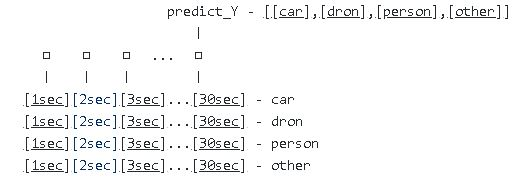

# RNN_model

rnn model
## yeom's model mk1(FAIL)
many to one 
 
input_dim = 2931 //10bits per 1 count => 5862/2 
sequence_length = 30 //I think 30sec is enough 
batch_size = 4 //only 4 kind of files used(MK1 is test) 
  
## model mk2

* * *
