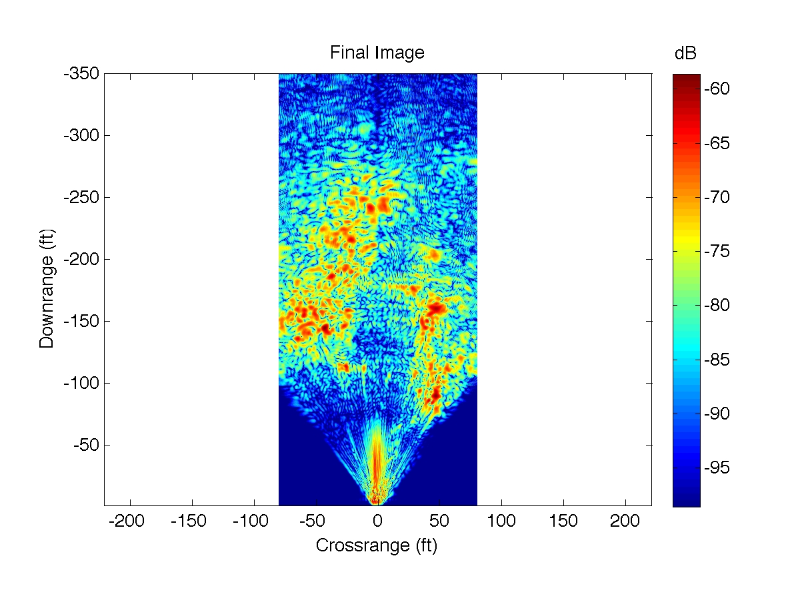
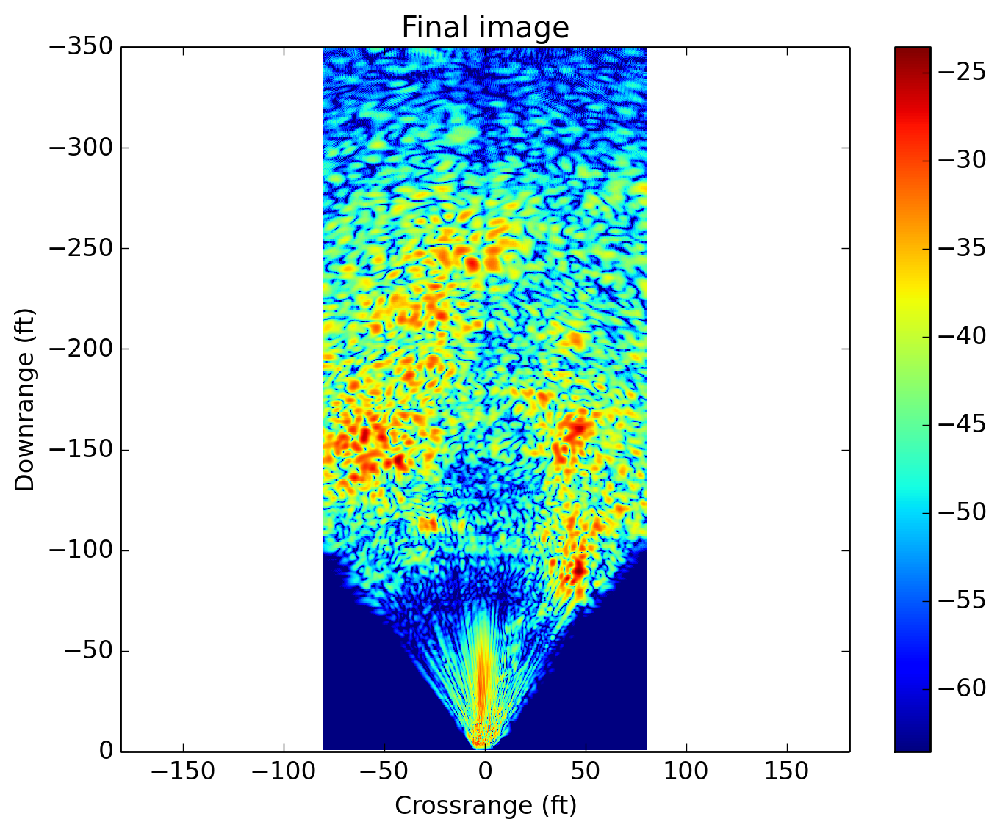

# From
https://github.com/Jach/radar_sar_rma/blob/master/make_sar_image.py

# About

This program is a fast Python implementation of the Range Migration Algorithm 
for generating SAR images using a radar like the one documented on this MIT
OpenCourseWare site:
http://ocw.mit.edu/resources/res-ll-003-build-a-small-radar-system-capable-of-sensing-range-doppler-and-synthetic-aperture-radar-imaging-january-iap-2011/index.htm
That site includes a Matlab program written by Dr. Gregory Charvat which also
generates SAR images, but it runs very slowly, thus motivating this project.

# License

This program was initially written by Kevin Secretan for a school project
while attending DigiPen Institute of Technology, and slightly modified and
cleaned up after graduation. The code is licensed under the
Creative Commons Attribution-NonCommercial-ShareAlike license.
(http://creativecommons.org/licenses/by-nc-sa/3.0/us/)
This is the same license as everything else on MIT OpenCourseWare websites,
because this constitutes a derivative work as Charvat's Matlab implementation
was used as a base reference. (In other words, I think the copyright
ultimately falls to him and/or MIT.)

(One marked function in the code is governed by a similar CC license
differing only in that it allows commercial use.)

Contributions are welcome via GitHub pull requests.

# Performance

Running the Matlab code distributed by MIT, you'll probably only have to
wait around 3-10 minutes for your SAR image, more or less depending on how
good your machine is. The 3-10 minute range comes from my own experience
with two different computers running Matlab.

In contrast, this Python implementation runs in around 3-10 *seconds* on
those same computers, and more importantly for my purposes it runs on
Linux and other platforms. If you try to run the Matlab SAR code
using Octave, you'll be waiting a long time for results.
In my tests on a Cubietruck embedded system, I was getting performance
for my code of about 40-60 seconds depending on system load and other factors.

An interesting benchmarking note is that outputting the PNG at 200dpi
takes a little more time than actually going through the RMA. You can
decrease this time by decreasing the dpi.

# Output Comparison

Matlab:


Python:


If you want to try this out yourself, download the Experiment 3 ZIP file
hosted by MIT at
http://ocw.mit.edu/resources/res-ll-003-build-a-small-radar-system-capable-of-sensing-range-doppler-and-synthetic-aperture-radar-imaging-january-iap-2011/projects/
and extract the 'towardswarehouse.wav' file into this program's directory,
and rename that file to have the prefix of 'mit-'. Then execute this Python
file, the defaults will take care of the rest.

The program supports several command-line options:
```
$ python2.7 make_sar_image.py -h
usage: make_sar_image.py [-h] [-f [F]] [-o [O]] [-rs [RS]] [-cr1 [CR1]]
                         [-cr2 [CR2]] [-dr1 [DR1]] [-dr2 [DR2]]
                         [-bgsub [BGSUB]]

Generate a SAR image outputted by default to 'sar_image.png' from a WAV file
of appropriate data.

optional arguments:
  -h, --help      show this help message and exit
  -f [F]          Filename containing SAR data in appropriate format (default:
                  mit-towardswarehouse.wav (prefix filename with 'mit-' to use
                  MIT's frequency range if your VCO range is different))
  -o [O]          Filename to save the SAR image to (default: sar_image.png)
  -rs [RS]        Downrange distance (ft) to calibration target at scene
                  center (default: 30)
  -cr1 [CR1]      Farthest crossrange distance (ft) left of scene center shown
                  in image viewport (default: -80, minimum: -170)
  -cr2 [CR2]      Farthest crossrange distance (ft) right of the scene center
                  shown in image viewport (default: 80, maximum: 170)
  -dr1 [DR1]      Closest downrange distance (ft) away from the radar shown in
                  image viewport (default: 1)
  -dr2 [DR2]      Farthest downrange distance (ft) away from the radar shown
                  in image viewport (default: 350, maximum: 565)
  -bgsub [BGSUB]  Filename containing SAR data representing a background
                  sample that will be subtracted from the main data given by
                  -f (default: None)

```

# Third party dependencies

I wrote this program targetting Python 2.7. I don't know if it would work
for any version of Python 3 or PyPy. Third party modules that you need to
install via pip, easy\_install, or your distribution's package manager,
are: Numpy (at least version 1.7), SciPy, and MatPlotLib (for PyLab).

## Suggestions for Windows users

Try the Enthought Python Distribution as the quickest way to get up
and going. Otherwise, install Python 2.7 directly from python.org, and here
is a link to a bunch of unofficial Windows builds for various
Python extensions: http://www.lfd.uci.edu/~gohlke/pythonlibs/
I've generally had more luck on Windows with 32-bit builds (and thus
you need a 32-bit version of Python), but your results may vary. Going
32-bit does limit your memory usage.

# History

For part of my junior and my entire senior projects at DigiPen Institute of
Technology, I was working on improving the radar system initially developed
by MIT linked to at the top of this README. The last semester of my junior
year was devoted to getting the project hardware and putting it together
then testing it with MIT's sample scripts and my own recorded data, plus
understanding the actual physics and signal processing that lets it all work.
Also during that semester I improved on MIT's software by having a real-time
interface in Python that would show speed and moving-object-range spectrograms
over time along with the time-domain wave, plus an estimate of the current
instantaneous range/speed. After I tried a UI in PyGame I discovered
https://github.com/enthought/chaco/blob/master/examples/demo/advanced/spectrum.py
and switched to a version based on that instead. Funnily enough after my
junior year finished,
over the summer I bothered to click through the team links in the 'selected
final results' section on MIT's site and found out that Gustavo
(http://goretkin.blogspot.com) had done basically the same thing I did,
also using Chaco's example as a base.

My senior year I had two semesters to work on the project. Ultimately
I made a [PCB](http://www.thejach.com/public/pcb_unpop.jpg) and got rid of
the breadboard and cut SMA and audio connectors; I switched out my laptop
for a battery-powered
[Cubietruck Cubieboard3](http://cubietruck.com/collections/frontpage/products/cubietruck-cubieboard3-cortex-a7-dual-core-2gb-ram-8gb-flash-with-wifi-bt)
embedded system running LUbuntu Linux (and using an iMic audio-to-usb adapter
because my Cubieboard's audio input was broken); I ordered some Cantennas
from Quonset Microwave since they started to sell them and they ended up
being better than my own uncalibrated (school doesn't have a network analyzer)
Cantennas; I built a time-lapse dolly out of PVC pipe, rollerblade wheels,
and a DC (!!) motor and pulley moving along a timing belt, all with the
hopes of automating SAR data collection (my design ultimately didn't work
out very well); I secured everything in a plastic crate with velcro or hot
glue; and finally I created a
[web-based interface](http://www.thejach.com/public/web_interface.png)
allowing for full remote access of the radar's data (interactive speed and
range spectrograms and ability to create and view SAR images from saved data)
along with nearly-full control of the system (namely the dolly motor and
ability to trigger manual (and automatic if the dolly worked as it should)
SAR data collection -- the missing software control was done by one hardware
switch on the project toggling the radar between Doppler and Ranging modes).

[Here](http://www.thejach.com/public/phys_realiz.jpg) is a picture
of the final project including its dolly platform. I wish I could release
the source code of my web interface and other details like a parts list or
the PCB schematic and layout or my final paper where all that is in one place,
but my school owns copyright
over anything I made or modified that wasn't already subject to someone
else's copyright (like this SAR code, thank goodness!), and they are not yet
enlightened on the merits of releasing things under a CC-like license.

I think this code is the most potentially useful thing to other people out
of my project anyway, which is why it's up here. About two days before the
deadline for my project paper, I found
out that someone else had tried to port this SAR algorithm to Python.
Batuhan Osmanoglu's project is here:
http://www.osmanoglu.org/sar/93-python-script-for-the-mit-radar-short-course

I tried it, and it was slow, and it didn't give the correct output. I glanced
at the source and noticed it was just literally porting from Matlab
syntax to Python syntax, preserving the variable names and including
all the explicit `for` loops that are
the cause of the sluggishness. (To Batuhan: the image of the incorrect output
reminds me of a state my version was once in too, I think it could be
because the second hanning window should actually be `1+hanning()` instead
of a plain `hanning()` like the first one is.)

But one thing it did do that none of my code did was save the actual
SAR image bitmap to disk. I wasn't aware of the PyLab library for this,
so I had just been saving the finished `S_image` data and friends to a .mat
file then running a simple Matlab script (with Octave in a subprocess) that
basically just read the data in and saved the result of `imagesc()` to disk.
It was too late to incorporate PyLab into my project code, but now that I've
graduated I've done this incorporation for this release. Interestingly it's
not much faster than the Octave subprocess way.

# Closing remarks

The project is behind me and I don't plan on doing anything more with radar,
but one never knows. I will respond to issues and pull requests though;
I'm especially interested if you have improvements to the code comments
that may improve mine or other people's understanding.

Finally, Dr. Charvat frequently references the book *Spotlight Synthetic
Aperture Radar: Signal Processing Algorithms* by Carrara, Goodman, and
Majewski. I acquired a copy of this book through my school's inter-library
loan, and before I had to return it I made a poor-quality copy with
my scanner at home. Parts are unreadable because they got cut off, but
Chapter 10 (which is all about the Range Migration Algorithm) is mostly
readable and if you want the PDF I made you can reach me at
radar@thejach.com. If you have any other questions or requests feel free
to contact me about those as well, but no promises.
